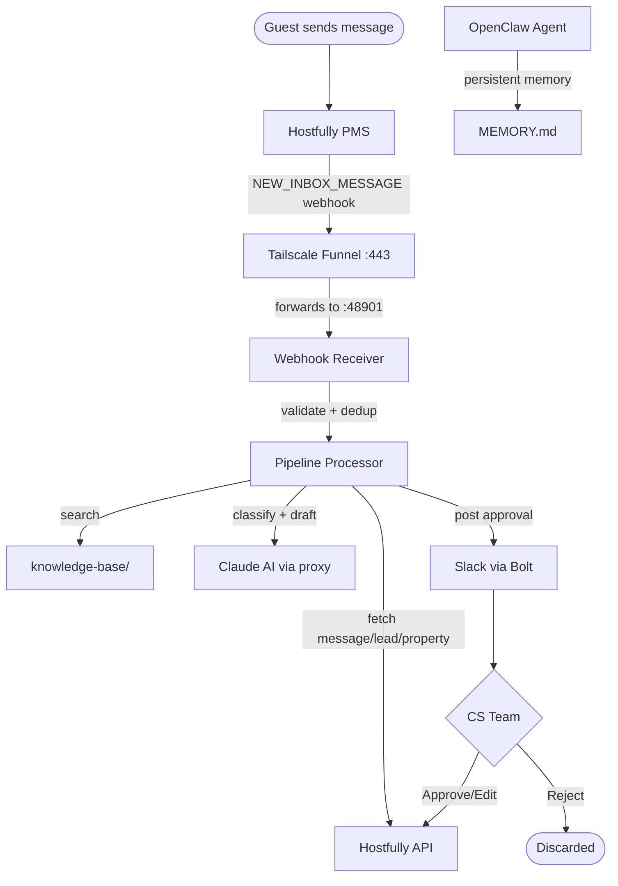

# Papi Chulo

A digital employee for VL Real Estate built on the OpenClaw agent runtime. Papi Chulo monitors Hostfully PMS for incoming guest messages, uses Claude AI to classify them and draft responses, then routes everything through a Slack approval workflow. The CS team sees a rich Slack message with guest name, property, dates, booking channel, and an AI-drafted reply — and can Approve, Reject, or Edit & Send. Nothing goes to the guest without human sign-off.

Built on OpenClaw for skill-based extensibility and persistent memory. Built with a modular skill architecture and a full audit trail.

---

## How It Works



When a guest sends a message, Hostfully fires a webhook to the local receiver via Tailscale Funnel. The pipeline fetches the full message thread, lead details, and property info from the Hostfully API, then searches the local knowledge base for relevant context. That package goes to Claude, which classifies the message type and drafts a response. The draft gets posted to Slack as a Block Kit message. A CS team member reviews it and either approves it (sends immediately), rejects it (discards), or edits it before sending. Hostfully handles the actual delivery to the guest.

The OpenClaw agent runs alongside the service, providing the skill execution runtime and maintaining persistent memory in `MEMORY.md` (created at runtime — doesn't pre-exist in the repo).

---

## Prerequisites

- **Bun** v1.3+ — [bun.sh](https://bun.sh)
- **Node.js** 22.21+ — required for the OpenClaw daemon (set in `.tool-versions`)
- **Tailscale** account with Funnel enabled — needed for a stable public webhook URL
- **Hostfully PMS** account with an API key
- **Slack workspace** with a bot app configured
- **Claude access** — either a Claude Max subscription (free via the `claude-max-api` proxy) or an Anthropic API key (pay-per-token)

---

## Quick Start

```bash
cp .env.example .env
# fill in credentials (see Configuration section)
bun install
openclaw gateway start  # if not already running as daemon
bun run start
```

`bun run start` handles the full startup sequence via `start.ts`:
1. Checks the OpenClaw gateway is running (warns if not — non-fatal)
2. Starts Tailscale Funnel on `WEBHOOK_PORT` and extracts the public URL (skipped if Tailscale isn't installed)
3. Starts the `claude-max-api` proxy on port 3456 — **only if** `CLAUDE_MODE=proxy` and the proxy isn't already running. Requires `claude-max-api` installed under Node 20.19.0 via asdf.
4. Starts the main service via `bun run src/index.ts`

---

## Configuration

All configuration lives in `.env`. Copy `.env.example` to get started.

| Variable | Required | Description |
|---|---|---|
| `BOT_NAME` | No | Display name used in logs and Slack messages. Default: `Papi Chulo` |
| `HOSTFULLY_API_KEY` | Yes | Found in Hostfully → Agency Settings → API |
| `HOSTFULLY_AGENCY_UID` | Yes | Your agency UID from Hostfully |
| `HOSTFULLY_API_URL` | No | Base URL. Default: `https://api.hostfully.com/api/v3.2` |
| `CLAUDE_MODE` | Yes | `proxy` (Claude Max subscription, free) or `api` (Anthropic API key, pay-per-token) |
| `CLAUDE_PROXY_URL` | If proxy | Claude proxy URL. Default: `http://127.0.0.1:3456` |
| `CLAUDE_MODEL` | Yes | Claude model ID (e.g. `claude-sonnet-4-20250514`) |
| `ANTHROPIC_API_KEY` | If api mode | Anthropic API key |
| `CLAUDE_RETRY_ATTEMPTS` | No | Retry attempts on transient failures. Default: `2` |
| `CLAUDE_TIMEOUT_MS` | No | Per-request timeout in milliseconds. Default: `30000` |
| `CLAUDE_FALLBACK_TO_API` | No | Fall back to Anthropic API if proxy unreachable. Requires `ANTHROPIC_API_KEY`. Default: `false` |
| `SLACK_BOT_TOKEN` | Yes | `xoxb-...` bot token |
| `SLACK_APP_TOKEN` | Yes | `xapp-...` Socket Mode token |
| `SLACK_CHANNEL_ID` | Yes | Channel ID (e.g. `C0XXXXXXXXX`) where approvals are posted |
| `WEBHOOK_PORT` | No | Local port for the webhook server. Default: `48901` |
| `WEBHOOK_PUBLIC_URL` | No | Public webhook URL. Auto-set by `start.ts` from Tailscale Funnel. Set manually if not using Tailscale. |
| `OPENCLAW_HOOKS_TOKEN` | Yes | 64-char hex token generated during OpenClaw onboarding |

---

## OpenClaw Setup

OpenClaw is the agent runtime that powers the skill system and persistent memory.

**Install:**

```bash
npm install -g openclaw@2026.3.13
```

Requires Node.js 22.21+. The `.tool-versions` file in this repo pins the correct version — use `asdf` or `mise` to activate it.

**Onboard (run once):**

```bash
openclaw onboard \
  --non-interactive \
  --accept-risk \
  --mode local \
  --auth-choice synthetic-api-key \
  --synthetic-api-key placeholder \
  --gateway-port 18789 \
  --gateway-bind loopback \
  --install-daemon \
  --daemon-runtime node \
  --skip-skills
```

**Verify:**

```bash
openclaw gateway status
```

The gateway must be running before you start the service. If it's installed as a daemon, it starts automatically on login. Otherwise, run `openclaw gateway start` manually.

---

## Webhook Registration

Hostfully needs to know where to send webhook events. This is a one-time setup.

```bash
WEBHOOK_PUBLIC_URL=https://your-tailscale-url.ts.net bun run scripts/register-webhook.ts
```

You only need to re-register if the public URL changes — for example, if you move to a different machine or Tailscale domain. Changing `WEBHOOK_PORT` does **not** require re-registration because Tailscale Funnel always serves on public port 443 regardless of the local port.

---

## Knowledge Base

The pipeline uses a hierarchical multi-property knowledge base in `knowledge-base/`. Two files are loaded per guest message:

- **`knowledge-base/common.md`** — Always loaded. Shared policies, common Q&A scenarios, property quick-reference table, and a service provider directory.
- **`knowledge-base/properties/{code}.md`** — Loaded based on the guest's property. 16 files covering all VL Real Estate properties, each with WiFi credentials, amenities, house rules, fees, and per-unit details.

The routing is done via `knowledge-base/property-map.json` — a JSON file mapping property names and addresses to their KB file. If the property isn't found, the pipeline falls back to `common.md` only.

**To regenerate the KB** when source data (XLSX files) changes:

```bash
bun run scripts/convert-xlsx-to-kb.ts --source /Users/victordozal/Downloads/properties-info/
```

**To preview without writing files:**

```bash
bun run scripts/convert-xlsx-to-kb.ts --dry-run
```

The more complete the KB is, the better the AI drafts will be. See `knowledge-base/discrepancy-report.md` for known gaps.

> **Note**: `knowledge-base.md` in the project root is the legacy single-file KB. It's kept for reference but is no longer used by the pipeline.

---

## Skills

The service is built as a set of composable OpenClaw skills. Each skill is a self-contained module in `skills/`.

| Skill | Description |
|---|---|
| `hostfully-client` | Hostfully API v3.2 client — fetches messages, leads, properties, and sends replies |
| `kb-reader` | Knowledge base search — `MultiPropertyKBReader` loads `common.md` + property-specific KB per guest message |
| `dedup` | Message deduplication — prevents the same message from being processed twice |
| `slack-blocks` | Block Kit message builders — constructs the rich Slack approval messages |
| `slack-bot` | Bolt app and approve/reject/edit handlers — manages the Slack interaction lifecycle |
| `thread-tracker` | Slack thread grouping — keeps follow-up messages in the same thread |
| `pipeline` | Full guest message processing pipeline — orchestrates all other skills end-to-end |
| `audit-logger` | JSONL audit logging — writes a structured log of every pipeline run to `logs/` |

---

## Testing

The simulate script fetches real messages from Hostfully and fires them at the local webhook. You'll see the full pipeline run and a real approval message appear in Slack.

```bash
# List recent guest messages from Hostfully
bun run scripts/simulate-webhook.ts --list

# Fire the most recent unprocessed message through the pipeline
bun run scripts/simulate-webhook.ts

# Fire a specific message by UID
bun run scripts/simulate-webhook.ts --uid <message-uid>

# Re-fire an already-processed message (ignores dedup)
bun run scripts/simulate-webhook.ts --force
```

---

## Troubleshooting

**Messages not appearing in Slack**

1. Check Tailscale Funnel is running:
   ```bash
   tailscale funnel status
   ```
   If you see "No serve config", restart it:
   ```bash
   tailscale funnel --bg $WEBHOOK_PORT
   ```
2. Check the service is up:
   ```bash
   curl http://localhost:48901/health
   ```
3. Check server logs for `[PIPELINE] Failed to post to Slack`. If you see `channel_not_found`, the bot hasn't been invited to the channel — run `/invite @YourBotName` in Slack.

**OpenClaw gateway not running**

```bash
openclaw gateway start
# or check current status
openclaw gateway status
```

If the gateway was installed as a daemon but isn't running, check your system's service manager or re-run the onboarding command with `--install-daemon`.

**Node version issues**

OpenClaw requires Node.js 22.21+. Confirm your active version:

```bash
node --version
```

If it's wrong, check that `.tool-versions` is being picked up by your version manager (`asdf` or `mise`). The file should contain `nodejs 22.21.1`.

**All messages show as "new" after restart**

This is normal if the dedup store was cleared. The store persists across restarts in `data/processed-messages.txt`. To reset it intentionally:

```bash
truncate -s 0 data/processed-messages.txt
```

---

## Development

This project uses **OpenCode** for AI-assisted development. `AGENTS.md` in the project root is the primary instruction file — it's read automatically by OpenCode and compatible tools (Codex, Cursor, Copilot, Windsurf).

```bash
bun test                    # Run tests
bun run typecheck           # TypeScript type checking
bun run scripts/simulate-webhook.ts  # Test pipeline with real messages
```

### Shell Scripts

All shell-type scripts in this project use [Google zx](https://github.com/google/zx) with TypeScript instead of plain bash. To create a new script:

```typescript
#!/usr/bin/env zx

import { $ } from 'zx'

await $`echo "Hello from zx"`
```

Run with `zx script-name.ts` or add a script entry to `package.json`.

---

## Roadmap

This is Phase 1 of a larger digital employee. The goal is a system that handles the entire guest communication lifecycle, with the CS team in the loop only where it matters.

**Current**
- Skill-based architecture via OpenClaw
- Monitor guest messages via Hostfully webhook
- AI classification and response drafting
- Slack approval workflow (approve / reject / edit & send)
- Multi-property knowledge base (common + 16 per-property KBs, auto-routed by property name)
- Persistent agent memory
- JSONL audit logging

**Phase 2 — Automation**
- Auto-respond for high-confidence classifications (>90%) without human approval
- Pre-arrival messages sent automatically 24h before check-in
- Unanswered message alerts after 30 minutes

**Phase 3 — Proactive**
- Review management: monitor and draft responses to guest reviews
- Cleaning coordinator: notify the cleaning team on new bookings and schedule changes
- Daily Slack summary: messages handled, response times, auto-response rate

**Phase 4 — Platform**
- Owner reporting with weekly occupancy and revenue summaries
- Support for additional PMS platforms (Guesty, Hostaway, Lodgify)
- Analytics dashboard
