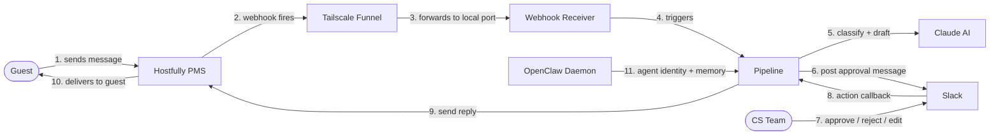
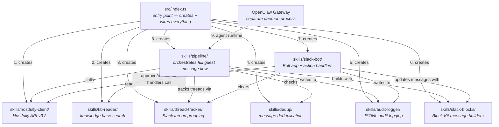
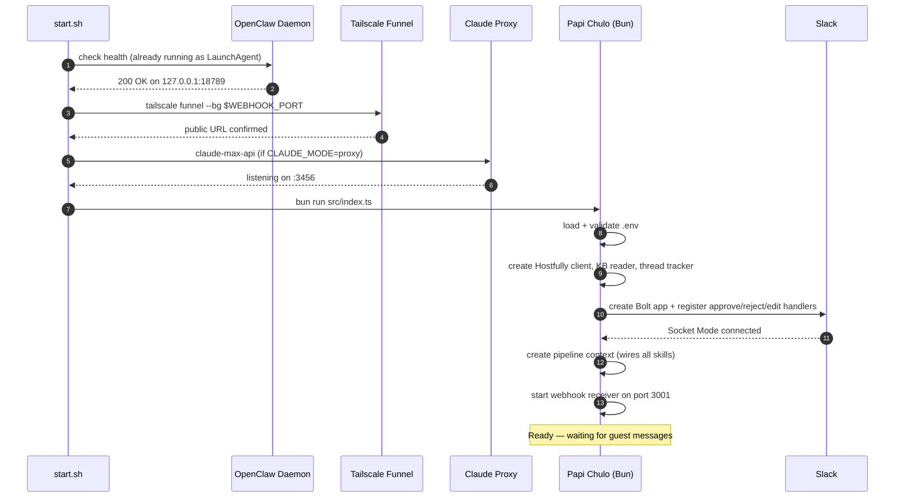
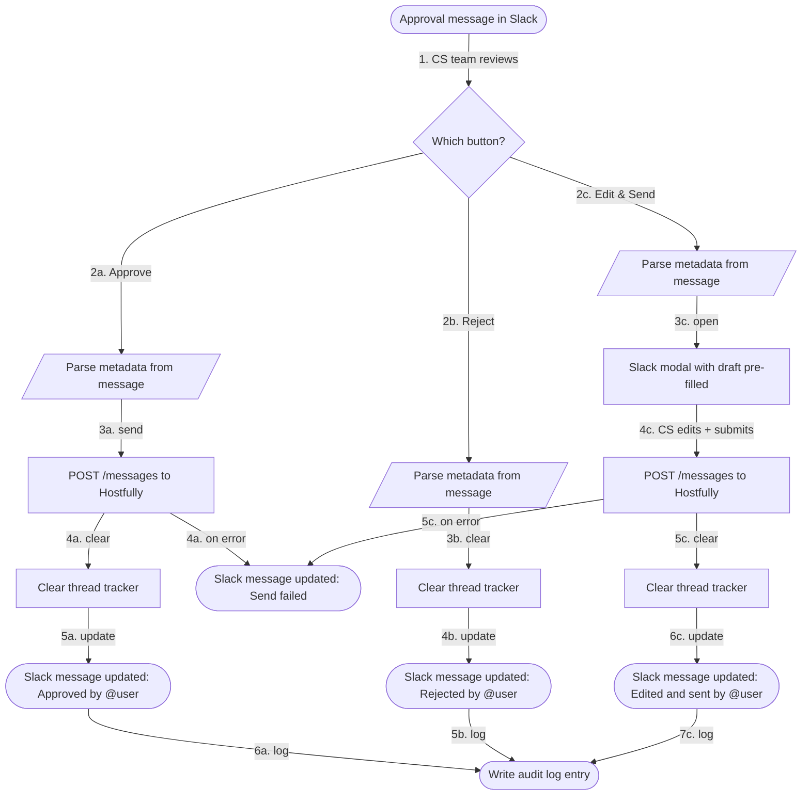
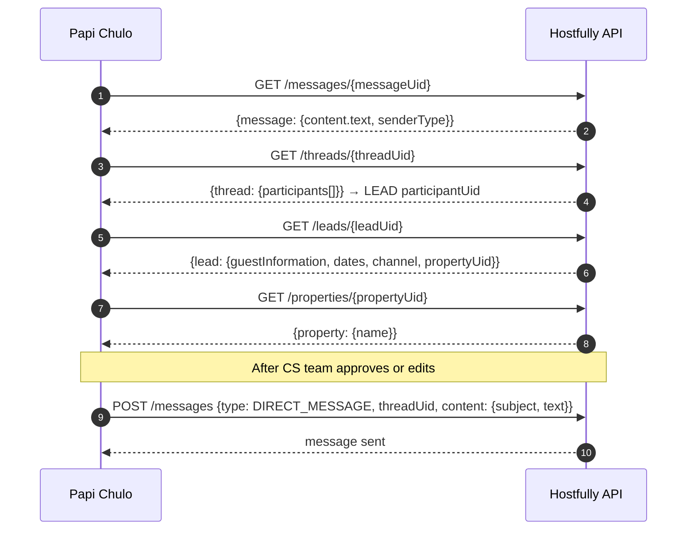
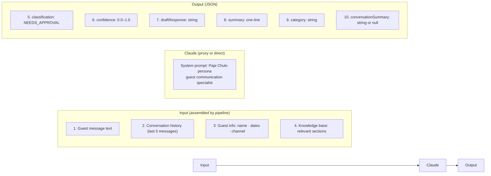
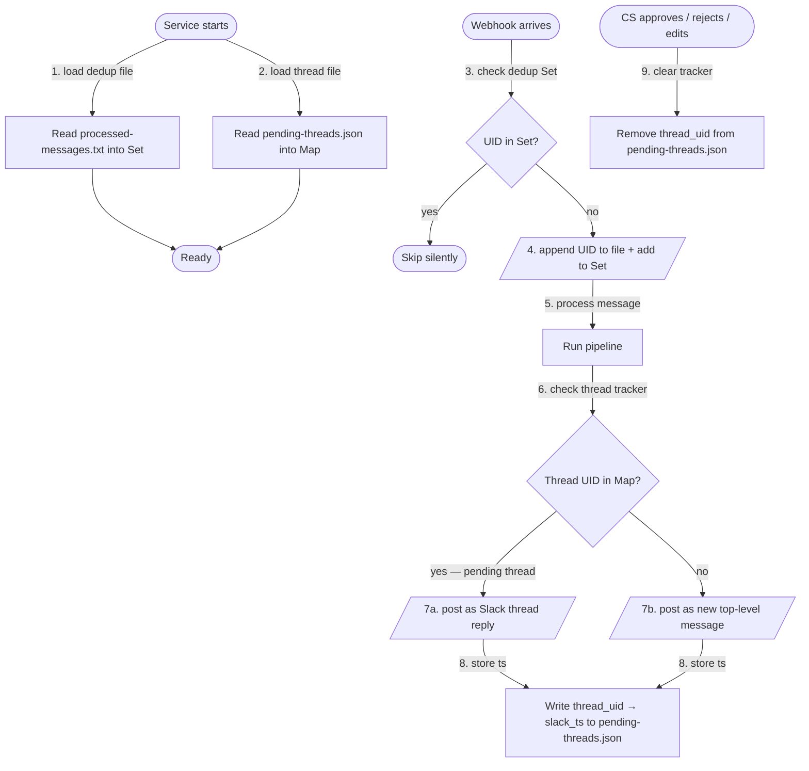
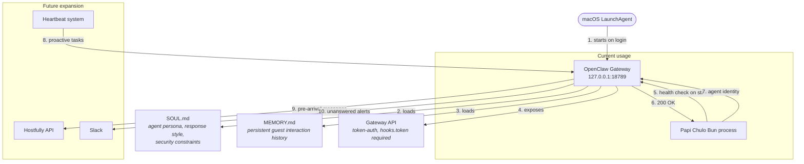

# Architecture

> This architecture documentation covers Papi Chulo — a digital employee built on the OpenClaw agent runtime. For agent persona and behavior, see `SOUL.md`. For developer setup, see `AGENTS.md`.

How Papi Chulo works, broken down into focused diagrams. Each diagram has numbered steps with explanations below it. OpenClaw runs as a persistent agent runtime alongside the Bun service.

---

## 1. System Context

The external systems Papi Chulo talks to and the order in which they interact during a single guest message. OpenClaw runs as a background daemon, providing agent identity, persistent memory, and a future expansion path for proactive tasks.



| # | What happens |
|---|---|
| 1 | Guest sends a message from Airbnb, VRBO, or direct booking |
| 2 | Hostfully fires a `NEW_INBOX_MESSAGE` webhook to the registered public URL |
| 3 | Tailscale Funnel receives the HTTPS request and forwards it to the local machine |
| 4 | The webhook receiver on port 3001 accepts the POST and hands it to the pipeline |
| 5 | The pipeline sends guest context to Claude, which classifies the message and drafts a reply |
| 6 | The draft and guest context are posted to Slack as an interactive Block Kit message |
| 7 | A CS team member reviews and clicks Approve, Reject, or Edit & Send |
| 8 | Slack sends the action back via Socket Mode (outbound WebSocket, no public URL needed) |
| 9 | The pipeline calls Hostfully to send the reply |
| 10 | Hostfully delivers the reply to the guest through the original booking channel |
| 11 | OpenClaw runs as a separate daemon, providing the agent persona (SOUL.md), persistent memory (MEMORY.md), and a gateway for future proactive tasks |

---

## 2. Internal Architecture — Skills

The skill-based architecture. `src/index.ts` creates and wires all skills together. Each skill is a self-contained module in its own directory under `skills/`.



| # | What it means |
|---|---|
| 1 | `hostfully-client` wraps the Hostfully API v3.2 — all GET and POST calls go through here |
| 2 | `kb-reader` searches `knowledge-base.md` for sections relevant to the guest's message |
| 3 | `thread-tracker` maps Hostfully thread UIDs to Slack message timestamps, so follow-up messages appear as thread replies |
| 4 | `dedup` prevents the same message from being processed twice using a flat file + in-memory Set |
| 5 | `audit-logger` writes a JSONL record for every approve, reject, and edit action |
| 6 | `slack-blocks` builds all Block Kit payloads — approval messages, modals, and update messages |
| 7 | `slack-bot` creates the Bolt app and registers the approve, reject, and edit action handlers |
| 8 | `pipeline` is the core orchestrator — it receives a webhook payload and runs all processing steps in order |
| 9 | OpenClaw runs as a separate daemon (not imported by Bun) — it provides agent identity, persistent memory, and a gateway for future tool-calling expansion |

---

## 3. Startup Sequence

What happens, in order, when you run `./start.sh`.



| # | What happens |
|---|---|
| 1 | `start.sh` verifies OpenClaw is already running as a macOS LaunchAgent — it's a persistent daemon, not started per-session |
| 2 | OpenClaw responds healthy on `127.0.0.1:18789` |
| 3 | Tailscale Funnel is started in background mode (`--bg`) — it persists after the terminal closes |
| 4 | Tailscale confirms the public HTTPS URL is active and forwarding to `localhost:$WEBHOOK_PORT` |
| 5 | The Claude proxy is started (only if `CLAUDE_MODE=proxy`), wrapping Claude Max as an OpenAI-compatible local API |
| 6 | The proxy confirms it's listening on port 3456 |
| 7 | Bun starts the main application process |
| 8 | `.env` is loaded and validated — missing required vars exit immediately with a clear error |
| 9 | Core skills are instantiated: Hostfully client, KB reader, thread tracker |
| 10 | The Slack Bolt app is created and the three action handlers (approve, reject, edit) are registered |
| 11 | Bolt connects to Slack via Socket Mode (outbound WebSocket, no inbound port needed) |
| 12 | The pipeline context is created, wiring all skills together into a single orchestrator |
| 13 | The webhook receiver starts listening on port 3001 for Hostfully POST requests |

---

## 4. Message Processing Pipeline

What happens inside Papi Chulo from the moment a webhook arrives to when the Slack approval message is posted.

```mermaid
flowchart TD
    W([Webhook POST arrives on port 3001]) -->|"1. check dedup"| D{Already processed?}
    D -->|"yes"| SKIP([Skip silently])
    D -->|"no"| MARK[/"2. mark as processed in dedup file"/]
    MARK -->|"3. fetch"| FM[GET /messages/{uid} — content.text + senderType]
    FM -->|"4. filter"| FT{senderType?}
    FT -->|"PROPERTY_MANAGER or SYSTEM"| SKIP2([Skip — not a guest message])
    FT -->|"GUEST / TRAVELER"| TH[/"5. fetch thread"/]
    TH -->|"6. extract leadUid from participants"| FL[GET /leads/{leadUid}]
    FL -->|"7. fetch property"| FP[GET /properties/{propertyUid}]
    FP -->|"8. search KB"| KB[Find relevant knowledge base sections]
    KB -->|"9. classify + draft"| CL[Call Claude via proxy or direct API]
    CL -->|"10. build message"| BK[Build Block Kit approval message]
    BK -->|"11. check thread tracker"| TRK{Pending Slack thread?}
    TRK -->|"yes — CS hasn't responded yet"| REP[/"12a. post as Slack thread reply"/]
    TRK -->|"no"| NEW[/"12b. post as new top-level Slack message"/]
    REP -->|"13. track"| TRACK[Store Slack message ts in thread tracker]
    NEW -->|"13. track"| TRACK
    TRACK --> WAIT([Waiting for CS team action])
```

| # | What happens |
|---|---|
| 1 | The message UID is checked against the in-memory dedup Set (loaded from `data/processed-messages.txt` at startup) |
| 2 | The UID is written to the dedup file immediately, before any processing, so a mid-pipeline crash can't cause a duplicate on restart |
| 3 | `GET /messages/{messageUid}` fetches the message content and `senderType` from Hostfully |
| 4 | If the sender is `PROPERTY_MANAGER` or `SYSTEM`, the message is skipped — only guest messages are processed |
| 5 | `GET /threads/{threadUid}` fetches the thread, which contains a `participants[]` array |
| 6 | The participant with `participantType: LEAD` holds the lead UID. `GET /leads/{leadUid}` fetches guest name, check-in/out dates, booking channel, and property UID |
| 7 | `GET /properties/{propertyUid}` fetches the property display name |
| 8 | `knowledge-base.md` is searched for sections relevant to the guest's message |
| 9 | Claude receives the guest message, conversation history, guest details, and KB context, then returns a classification and draft response |
| 10 | The Block Kit approval message is assembled with all guest context and three action buttons |
| 11 | The thread tracker is checked: if a Slack thread already exists for this Hostfully thread and the CS team hasn't responded yet, the new message goes in as a reply |
| 12a | If a pending thread exists, the message is posted as a reply to keep the conversation grouped |
| 12b | If no pending thread exists (first message, or CS already responded), a new top-level Slack message is posted |
| 13 | The Slack message timestamp is stored in the thread tracker, keyed by Hostfully thread UID |

---

## 5. Slack Approval Workflow

The three paths available to the CS team after an approval message appears in Slack. Each path parses the metadata embedded in the Slack message, then takes action.



| # | What happens |
|---|---|
| 2a | CS team clicks **Approve** — metadata (thread UID, draft text, guest info) is parsed from the Slack message payload |
| 3a | Papi Chulo calls `POST /messages` on Hostfully with the AI-drafted text |
| 4a | The thread tracker entry for this Hostfully thread is cleared, so the next guest message starts a new top-level Slack message |
| 5a | The original Slack message is replaced with a confirmation showing who approved it. On failure, it shows the error |
| 6a | An audit log entry is written to the JSONL file |
| 2b | CS team clicks **Reject** — no Hostfully call is made |
| 3b | The thread tracker is cleared |
| 4b | The Slack message is updated to show it was rejected and by whom |
| 5b | An audit log entry is written |
| 2c | CS team clicks **Edit & Send** — a Slack modal opens with the AI draft pre-filled |
| 3c | The modal is opened with the draft text in an editable text field |
| 4c | The CS team edits the text and clicks Submit |
| 5c | Papi Chulo sends the edited text via Hostfully. The thread tracker is cleared on success |
| 6c | The original Slack message is updated to show the edited text was sent |
| 7c | An audit log entry is written |

---

## 6. Hostfully API Calls Per Message

The exact sequence of API calls Papi Chulo makes for every guest message, and what each one returns. All responses come wrapped in envelopes that the client unwraps before returning.



| # | What is fetched and why |
|---|---|
| 1 | Fetch the message content (`content.text`) and `senderType`. The response is wrapped in `{message: ...}` — the client unwraps it. Used to filter non-guest messages |
| 2 | Fetch the thread to find the lead UID. The webhook payload doesn't reliably include `lead_uid`, so it's extracted from `participants[]` where `participantType === LEAD`. Response wrapped in `{thread: ...}` |
| 3 | Fetch the lead (reservation) for guest name, check-in/out dates, booking channel, and property UID. Response wrapped in `{lead: ...}` |
| 4 | Fetch the property for its display name. Response wrapped in `{property: ...}` |
| 5 | After CS approval or edit, send the reply. The request body requires `type: DIRECT_MESSAGE`, `threadUid`, and `content: { subject: null, text: "..." }` |

---

## 7. Claude Classification

What goes into Claude and what comes back out on every message. Two modes are supported: proxy (routes through `claude-max-api` on localhost:3456) and direct (calls the Anthropic API with an API key).



| # | Detail |
|---|---|
| 1 | The raw text of what the guest sent |
| 2 | Up to the last 5 messages in the thread, formatted as `[GUEST]: ...` / `[PROPERTY_MANAGER]: ...` |
| 3 | Guest first name, check-in and check-out dates, booking channel (Airbnb, VRBO, etc.) |
| 4 | Sections from `knowledge-base.md` that match keywords in the guest's message |
| 5 | Always `NEEDS_APPROVAL` — nothing is auto-sent without CS team review |
| 6 | Claude's confidence in its draft (0.0–1.0). Shown in Slack as green (≥80%), yellow (≥50%), or red (below 50%) |
| 7 | The suggested reply text, pre-filled in the Slack message and in the Edit modal |
| 8 | A one-line description of the message used as the Slack notification preview |
| 9 | Message category (e.g. check-in question, maintenance request) |
| 10 | A summary of the conversation so far. `null` if this is the first message in the thread |

---

## 8. Thread Grouping — Dedup and Thread Tracker

Two persistence mechanisms work together to handle message deduplication and Slack thread grouping. Both use flat files on disk so state survives restarts.



| # | What happens |
|---|---|
| 1 | On startup, `data/processed-messages.txt` is read line by line into an in-memory `Set<string>` — lookups are O(1) |
| 2 | `data/pending-threads.json` is read into a Map keyed by Hostfully thread UID, with Slack message timestamps as values |
| 3 | When a webhook arrives, the message UID is checked against the dedup Set before anything else |
| 4 | If new, the UID is appended to the file and added to the Set before processing starts — a crash mid-pipeline won't cause a duplicate on restart |
| 5 | The pipeline runs normally |
| 6 | The thread tracker is checked: does a pending Slack thread exist for this Hostfully thread? |
| 7a | If yes (CS hasn't responded yet), the new Slack message is posted as a reply to keep the conversation grouped |
| 7b | If no (first message, or CS already responded), a new top-level Slack message is posted |
| 8 | The Slack message timestamp is written to `pending-threads.json`, keyed by Hostfully thread UID |
| 9 | When CS approves, rejects, or edits, the thread tracker entry is cleared — the next guest message in this thread will start a fresh top-level Slack message |

---

## 9. OpenClaw Agent Runtime

How OpenClaw fits into the architecture. It runs as a persistent background daemon, separate from the Bun process, and provides the agent identity, memory, and future expansion path.



| # | What happens |
|---|---|
| 1 | OpenClaw is registered as a macOS LaunchAgent — it starts automatically on login and stays running as a daemon |
| 2 | `SOUL.md` defines Papi Chulo's agent persona: role, response style, tone, and security constraints |
| 3 | `MEMORY.md` stores persistent guest interaction history across sessions — survives restarts |
| 4 | The gateway exposes an HTTP API on `127.0.0.1:18789`. All requests require a token (`hooks.token`) for authentication |
| 5 | When `start.sh` runs, it checks OpenClaw's health before starting the Bun process |
| 6 | OpenClaw responds with 200 OK, confirming the daemon is healthy |
| 7 | The Bun pipeline currently runs its own logic (not via OpenClaw tool-calling) — OpenClaw provides the agent identity and memory layer |
| 8 | The heartbeat system (available but not yet wired) enables future proactive tasks on a schedule |
| 9 | Future: OpenClaw sends pre-arrival messages automatically 24h before check-in |
| 10 | Future: OpenClaw posts unanswered message alerts to Slack after a configurable timeout |
