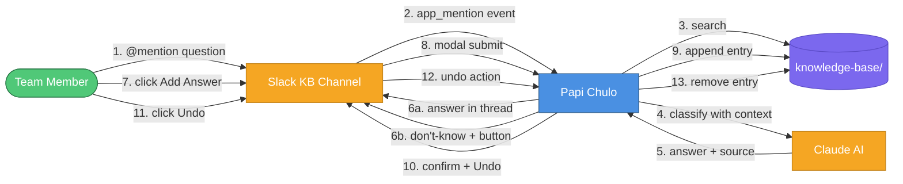
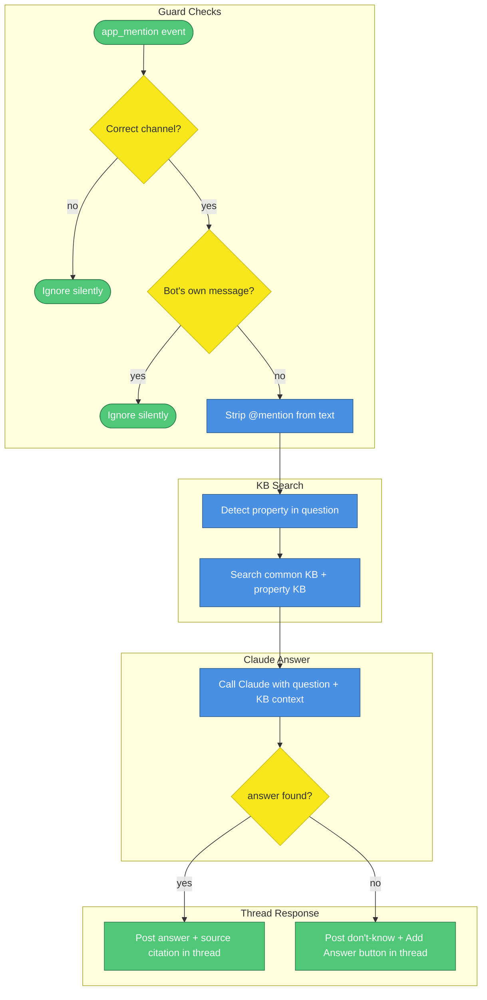
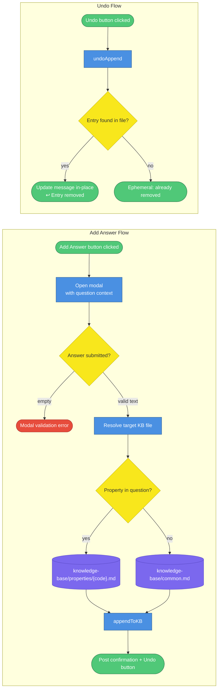
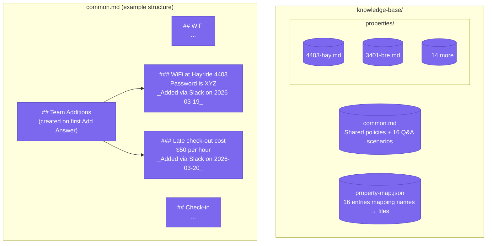
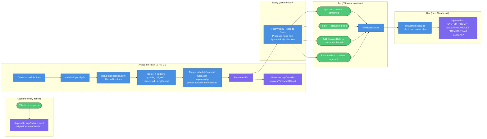
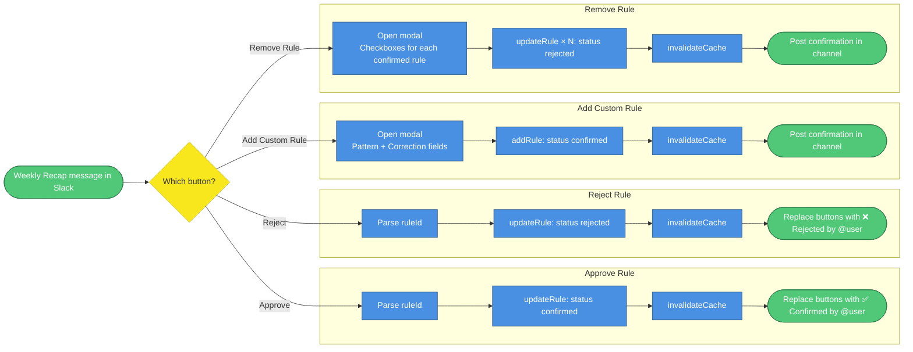
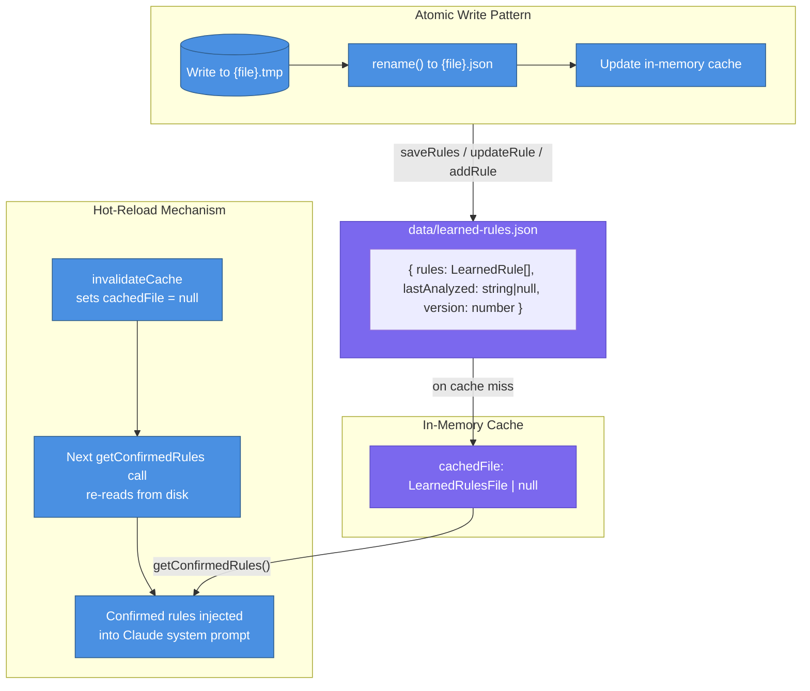
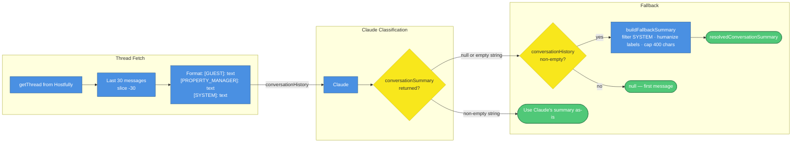

# Internal KB Assistant & Learned Rules

> This document covers two interrelated features added to Papi Chulo: the **Internal KB Assistant** (team members ask questions in Slack, Papi Chulo answers from the knowledge base) and the **Learned Rules System** (Papi Chulo detects patterns in CS team edits, proposes new response rules, and lets the team manage them from Slack). For the core guest messaging pipeline, see `2026-03-18-1312-architecture.md`.

<!-- Mermaid Color Palette (matches architecture.md)
classDef service fill:#4A90E2,stroke:#2E5C8A,color:#fff
classDef storage fill:#7B68EE,stroke:#5B4BC7,color:#fff
classDef external fill:#F5A623,stroke:#C4841A,color:#fff
classDef decision fill:#F8E71C,stroke:#C7B916,color:#333
classDef event fill:#50C878,stroke:#2D7A4A,color:#fff
classDef error fill:#E74C3C,stroke:#A93226,color:#fff

Legend: blue=service, purple=storage, orange=external, yellow=decision, green=event, red=error
-->

---

## 1. KB Assistant — System Context

The KB Assistant is an internal Q&A tool that runs inside the same Papi Chulo process. Team members @mention the bot in a designated Slack channel; the bot searches the knowledge base and either answers or invites the team to contribute a new answer.

| # | What happens |
|---|---|
| 1 | A team member types `@Papi Chulo what's the WiFi at Hayride 4403?` in the designated KB channel (`SLACK_KB_CHANNEL_ID`) |
| 2 | Slack fires an `app_mention` Socket Mode event to Papi Chulo |
| 3 | `MultiPropertyKBReader.search()` searches the common KB plus the matching property KB (if a property name/address is detected in the question) |
| 4 | The KB context sections and the question are sent to Claude via the Anthropic API |
| 5 | Claude returns a structured JSON result: `{ found, answer, source }` |
| 6a | If the answer was found, Papi Chulo replies in a thread under the original question, with the answer text and a source citation |
| 6b | If the answer was not found, Papi Chulo replies with "I don't have this in my knowledge base" and a **📝 Add Answer** button |
| 7 | Any team member clicks the **Add Answer** button |
| 8 | A modal opens pre-filled with the original question; the team member types the answer and submits |
| 9 | The answer is appended to the correct KB file (`knowledge-base/common.md` or `knowledge-base/properties/{code}.md`) under the `## Team Additions` section. The KB reader picks it up immediately on the next question (reads from disk on every call) |
| 10 | A confirmation is posted in the thread with the added text and a permanent **↩️ Undo** button |
| 11 | Any team member can click **Undo** at any time |
| 12 | Slack fires a `kb_undo_add` action |
| 13 | The exact text that was appended is surgically removed from the KB file; the confirmation message updates to "Entry removed" |

---

## 2. KB Assistant — Question Flow

The full decision path from an @mention arriving to the response being posted.

| # | Detail |
|---|---|
| 1 | Only events in `SLACK_KB_CHANNEL_ID` are processed — all other channels are silently ignored |
| 2 | Messages with a `bot_id` field are skipped to prevent the bot from responding to its own output |
| 3 | `<@UBOT_ID>` mention tokens are stripped from the message text, leaving just the question |
| 4 | `detectPropertyInQuestion()` scans the question against all 16 property names, codes, and addresses in `property-map.json` using the same partial-match logic as the KB reader |
| 5 | `MultiPropertyKBReader.search()` returns matching sections — property-specific results first, then common KB results |
| 6 | Claude receives the system prompt (`KB_ASSISTANT_PROMPT`) and the question + KB context. It must respond in a strict JSON format: `{"found": bool, "answer": string|null, "source": string|null}` |
| 7 | If `found === true`, the answer is posted in a Slack thread with a `Source:` citation line |
| 8 | If `found === false`, the "I don't know" message is posted with the **📝 Add Answer** button. The button's `value` payload embeds the original question and the Slack message timestamp |

---

## 3. KB Assistant — Add Answer & Undo Flow

The path when a team member contributes a new KB entry and optionally reverts it.

| # | Detail |
|---|---|
| 1 | The **Add Answer** button value carries `{ question, threadTs }` — the modal's `private_metadata` stores `{ question, channelId, threadTs }` so the submission handler knows where to post the confirmation |
| 2 | Empty answer text is caught by a Slack validation error response — the modal stays open with an inline error |
| 3 | `resolveKBFilePath()` detects a property in the original question and maps it to the correct KB file. If no property is found, the answer goes to `common.md` |
| 4 | `appendToKB()` atomically writes to the KB file (write to `.tmp` then `rename()`). It creates a `## Team Additions` section if one doesn't exist yet, or inserts the new entry directly after the existing header |
| 5 | Each entry is formatted as `### {first 60 chars of answer}\n{full answer}\n\n_Added via Slack on YYYY-MM-DD_\n` |
| 6 | The Undo button's `value` payload carries `{ filePath, appendedText }` — the exact string that was inserted, so it can be surgically removed |
| 7 | `undoAppend()` does an exact string replacement, then collapses any triple blank lines left behind. Atomic write using the same tmp+rename pattern |
| 8 | If the entry is already gone (manual edit, or double-click), an ephemeral "already removed" message is shown only to the clicking user |

---

## 4. Knowledge Base File Structure

How the KB files are organized and how the Team Additions section looks on disk.

| Detail | Explanation |
|---|---|
| **common.md** | Loaded for every question. Contains shared policies, 16 pre-built Q&A scenarios, a property quick-reference table, and the service provider directory |
| **properties/{code}.md** | Loaded only when a property is detected in the question. Contains WiFi, amenities, house rules, fees, and per-unit details |
| **## Team Additions** | Auto-created at the bottom of the target file on first use. All KB assistant additions go here. The KB reader's section parser picks up `### Entry` sub-headers as individual searchable sections |
| **Atomic write** | `appendToKB()` and `undoAppend()` write to `{file}.tmp` then `rename()` to the target, preventing partial writes from corrupting the KB |
| **Live updates** | `MultiPropertyKBReader` reads from disk on every call — no caching. A Team Additions entry is searchable immediately after it's written |

---

## 5. Learned Rules System — Weekly Lifecycle

Papi Chulo monitors how the CS team edits its draft responses and proposes rules to improve future drafts. The full cycle runs automatically every Friday at 12:00 PM CST.

| # | What happens |
|---|---|
| 1 | Every time a CS team member edits a draft before sending, the audit logger writes both the `originalDraft` (Claude's suggestion) and `editedText` (what was actually sent) to `logs/actions.jsonl` |
| 2 | Every Friday at 12:00 PM CST, the `croner` scheduler fires `runWeeklyAnalysis()` (`0 12 * * 5`, `America/Chicago` timezone) |
| 3 | The analyzer reads all edit entries from the JSONL file and detects four patterns: greeting removed, sign-off removed, message shortened >30%, message lengthened >50% |
| 4 | Patterns that appear at least twice (frequency ≥ 2) are proposed as new rules. Patterns already in `data/learned-rules.json` as proposed, confirmed, or rejected are skipped |
| 5 | The merged rule set is saved atomically to `data/learned-rules.json` (tmp + rename) |
| 6 | A markdown recap is generated at `logs/weekly-recap-YYYY-MM-DD.md` as a permanent record |
| 7 | The Weekly Recap message is posted to the guest approval Slack channel (`SLACK_CHANNEL_ID`) |
| 8 | Each proposed rule has Approve and Reject buttons; the message also has Add Custom Rule and Remove Rule buttons |
| 9 | On any button action, `invalidateCache()` is called so the next classification uses the updated rule set — no restart required |
| 10 | `getConfirmedRules()` is called inside `callClaude()` on every classification. Because it reads from the in-memory cache (which was just invalidated), new rules take effect on the very next guest message |

---

## 6. Learned Rules — Slack Recap Interactions

The five actions the CS team can take from the weekly recap message.

| Action | What it does | Takes effect |
|---|---|---|
| **Approve** | Sets rule `status: confirmed`. `invalidateCache()` forces reload on next classification. Recap buttons replaced with status text (idempotent — double-clicks are safe) | Immediately — next guest message |
| **Reject** | Sets rule `status: rejected`. Prevents the same pattern from being re-proposed in future weekly runs | Immediately |
| **Add Custom Rule** | Modal with two fields: "What does the AI do wrong?" (pattern) and "How should it respond instead?" (correction). Goes directly to `confirmed` — no approval step needed | Immediately |
| **Remove Rule** | Modal with checkboxes listing all confirmed rules. Selected rules set to `rejected`, deactivating them. Does not delete the entry — rejected rules prevent re-proposal | Immediately |

---

## 7. Rules Store — Persistence & Hot-Reload

How `data/learned-rules.json` is managed and how confirmed rules reach Claude without a service restart.

| Detail | Explanation |
|---|---|
| **Cache** | `rules-store.ts` holds `cachedFile` at module level. On first call, it reads `data/learned-rules.json` and caches the result. Subsequent calls use the cache — no repeated disk I/O per guest message |
| **Hot-reload** | Any Slack button action (approve, reject, add, remove) calls `invalidateCache()` after mutating the file. The next `getConfirmedRules()` call re-reads from disk — new rules take effect on the next guest classification without restarting the service |
| **Atomic write** | All writes go through `saveRules()`, which writes to `{file}.tmp` then calls `rename()`. This prevents partial writes from corrupting the file (e.g., if the process crashes mid-write) |
| **Rule statuses** | `proposed` — detected by analyzer, pending CS team review. `confirmed` — approved by CS team, injected into Claude prompt. `rejected` — dismissed by CS team, excluded from prompts and excluded from re-proposal |
| **`data/` is gitignored** | `data/learned-rules.json` is not committed to git. It is created automatically on first use. `loadRules()` returns `[]` gracefully if the file doesn't exist |
| **Missed runs** | On startup, `checkMissedRun()` compares the current time to `lastAnalyzed`. If more than 7 days have passed (or it's never been run), the analysis fires immediately |

---

## 8. Conversation Summary — Deterministic Fallback

Every follow-up guest message now always shows conversation context in Slack, regardless of whether Claude returns a summary.

| Detail | Explanation |
|---|---|
| **30 messages** | Thread fetch uses `.slice(-30)` — up from the original 5. Guests often send multiple consecutive messages; 5 was insufficient for a full picture |
| **Fallback triggers on `\|\|`** | Uses `claudeSummary \|\| fallback` (not `??`). This catches both `null` and empty string `""` — Claude occasionally returns an empty string instead of null |
| **`buildFallbackSummary()`** | Filters out `[SYSTEM]` messages (booking confirmations are noise), maps `[GUEST]`/`[TRAVELER]` → `Guest:` and `[PROPERTY_MANAGER]` → `Host:`, caps output at 400 characters with `…` |
| **Always guaranteed** | If `conversationHistory` is non-empty and Claude returns null/empty, the CS team always sees "📋 Conversation so far" in Slack — even without a natural-language summary |
| **First message** | If `conversationHistory` is empty (first message in the thread), both Claude's summary and the fallback return null. The "📋 Conversation so far" section is correctly omitted |

---

## Setup Checklist

Before the KB Assistant is operational, four manual steps are required in the Slack API dashboard and environment config.

| Step | What to do |
|---|---|
| 1. OAuth Scope | In [api.slack.com](https://api.slack.com/apps) → OAuth & Permissions → Bot Token Scopes → add `app_mentions:read` |
| 2. Event Subscription | In the Slack app settings → Socket Mode → Event Subscriptions → add `app_mention` event |
| 3. Environment Variable | Add `SLACK_KB_CHANNEL_ID=<channel-id>` to `.env`. Get the channel ID from Slack: right-click the channel → View channel details → copy the ID at the bottom |
| 4. Invite the bot | In Slack, go to the KB channel and type `/invite @Papi Chulo` |

The Learned Rules system and the Conversation Summary fallback require no additional setup — they activate automatically when the service restarts.
