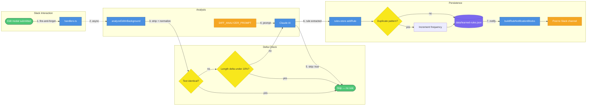
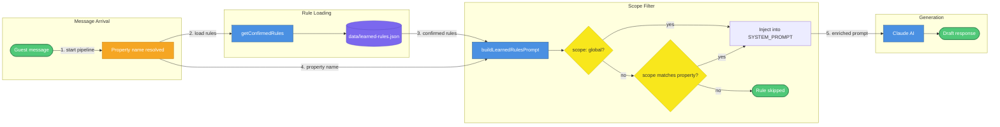
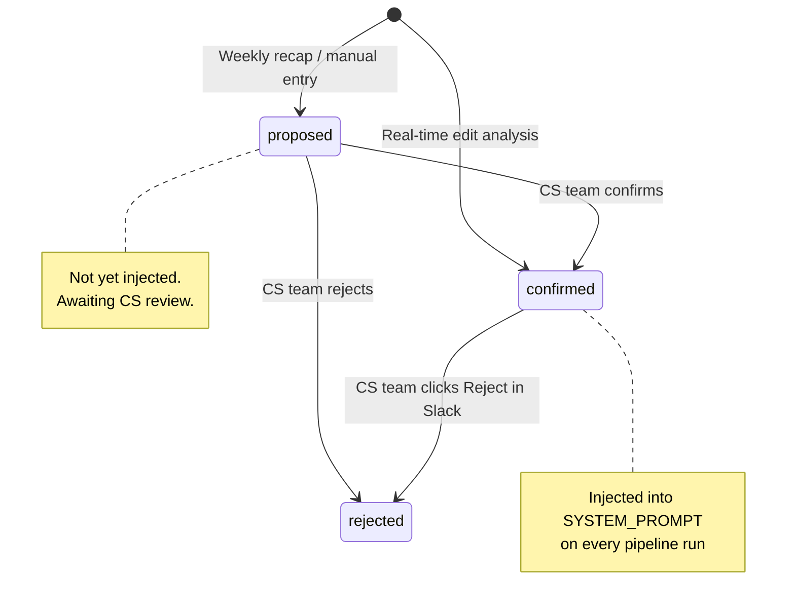
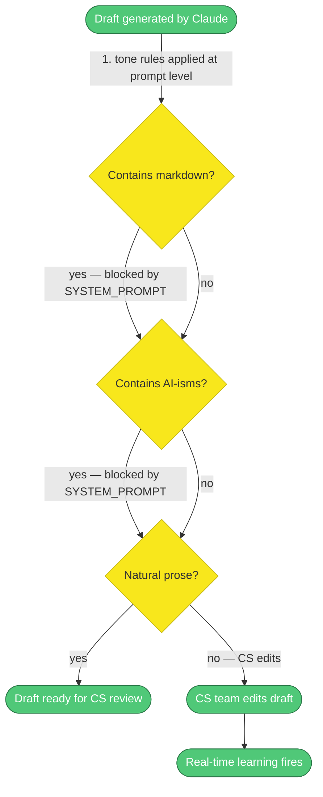

# Feedback Learning Loop and Human Tone System

> This document covers two systems added to Papi Chulo after the initial launch: the real-time feedback learning loop (which extracts rules from CS team edits and injects them into future AI prompts) and the human tone system (which enforces plain, natural prose in every AI-drafted guest reply).

Two systems that make Papi Chulo's drafts better over time. The feedback loop watches what the CS team changes, extracts a generalizable rule from each edit, and injects those rules into the Claude system prompt going forward. The tone system bakes in a strict set of prose rules at the prompt level so drafts never sound like a corporate chatbot.

<!-- Mermaid Color Palette (used in all diagrams below)
classDef service fill:#4A90E2,stroke:#2E5C8A,color:#fff
classDef storage fill:#7B68EE,stroke:#5B4BC7,color:#fff
classDef external fill:#F5A623,stroke:#C4841A,color:#fff
classDef decision fill:#F8E71C,stroke:#C7B916,color:#333
classDef event fill:#50C878,stroke:#2D7A4A,color:#fff
classDef error fill:#E74C3C,stroke:#A93226,color:#fff
classDef future fill:#B0B0B0,stroke:#808080,color:#333,stroke-dasharray: 5 5

Legend: blue=service, purple=storage, orange=external, yellow=decision, green=event, red=error, gray-dashed=future
-->

---

## 1. Edit-to-Rule Flow

When a CS team member edits an AI draft in Slack and submits the modal, Papi Chulo fires a background analysis job. The job checks whether the edit is meaningful, calls Claude to extract a rule, and saves it to disk. The CS team never waits for this — it runs entirely after the Slack response is already sent.

| # | What happens |
|---|---|
| 1 | The edit modal submit handler in `handlers.ts` fires the analysis as a fire-and-forget call — the Slack response is already sent before analysis begins |
| 2 | `analyzeEditInBackground()` in `skills/pipeline/real-time-analyzer.ts` runs asynchronously and never blocks the CS team's workflow |
| 3 | The original and edited texts are stripped (lowercase, whitespace-normalized). If they're identical, or if the length delta is under 10%, the analysis is skipped entirely |
| 4 | `DIFF_ANALYZER_PROMPT` from `skills/pipeline/diff-analyzer-prompt.ts` is sent to Claude along with the original and edited texts |
| 5 | Claude returns JSON: `{pattern, correction, scope, skip, skipReason}`. If `skip: true`, no rule is created |
| 6 | A `LearnedRule` is created with `status: 'confirmed'` (bypassing the `proposed` state) and passed to the `onRuleCreated` callback |
| 7 | `addRule()` in `skills/pipeline/rules-store.ts` saves the rule to `data/learned-rules.json`. If the same pattern already exists, it throws `DUPLICATE_PATTERN` and the caller increments `frequency` instead |
| 8 | `buildRuleNotificationBlocks()` in `skills/slack-blocks/notification-blocks.ts` builds a Block Kit notification with a Reject button (`action_id: 'reject_rule'`), posted to `SLACK_CHANNEL_ID` |

---

## 2. Rule Injection Pipeline

Every time a guest message is processed, the pipeline loads all confirmed rules from disk and injects the relevant ones into the Claude system prompt. Rules are filtered by scope before injection — global rules always apply, property-scoped rules only apply when the guest's property matches.

| # | What happens |
|---|---|
| 1 | The pipeline resolves the property name from the Hostfully lead data |
| 2 | `getConfirmedRules()` in `skills/pipeline/processor.ts` reads `data/learned-rules.json` fresh on every request — no in-memory cache, so new rules take effect immediately |
| 3 | All rules with `status: 'confirmed'` are returned |
| 4 | `buildLearnedRulesPrompt(rules, propertyName?)` receives both the rules and the resolved property name |
| 5 | Each rule is checked: if `scope === 'global'`, it's always included. If `scope` is a property name string, it's only included when that property's guest is being served. Rules with any other scope are skipped |
| 6 | The filtered rules are formatted and appended to the Claude system prompt before the API call |

---

## 3. Rule Lifecycle

New rules created by the real-time feedback loop skip the `proposed` state and go straight to `confirmed`. The weekly recap flow (for manually proposed rules) still uses the full `proposed → confirmed` path. Any confirmed rule can be rejected by the CS team via the Reject button in the Slack notification.

| State | Description |
|---|---|
| `proposed` | Rule is awaiting CS review. Not injected into prompts. Created by the weekly recap flow or manual entry |
| `confirmed` | Rule is active. Injected into the Claude system prompt on every pipeline run that matches its scope |
| `rejected` | Rule is inactive. Never injected. Can be reached from either `proposed` or `confirmed` |
| Bypass path | Rules created by `analyzeEditInBackground()` are auto-confirmed — they skip `proposed` entirely and are active immediately |

---

## 4. Tone Check Pipeline

The human tone system operates at the prompt level. Every AI draft passes through a set of rules baked into the Claude system prompt before the CS team ever sees it. If the draft still needs adjustment, the CS team edits it — and that edit feeds back into the learning loop.

| # | What happens |
|---|---|
| 1 | Claude generates a draft with the full SYSTEM_PROMPT applied — tone rules are enforced at generation time, not post-processed |
| 2 | The prompt explicitly bans markdown: no `**bold**`, `*italic*`, `# headers`, numbered lists, or bullet points |
| 3 | 20+ AI-ism phrases are blocked by name in the prompt: "delve into", "Great question!", "multifaceted", "No worries at all", "Here's what you need to know", "Moving forward", "seamless", "leverage", and others |
| 4 | The prompt requires plain text prose, casual connectors (So / Plus / Also), varied sentence starts, and acknowledging the guest's situation before answering |
| 5 | GOOD/BAD response examples (few-shot guidance) and a FORMATTING RULES section with inline BAD/GOOD pairs are included in the prompt |
| 6 | If the draft still doesn't sound right, the CS team edits it in the Slack modal — that edit triggers the real-time learning loop (Diagram 1) |
