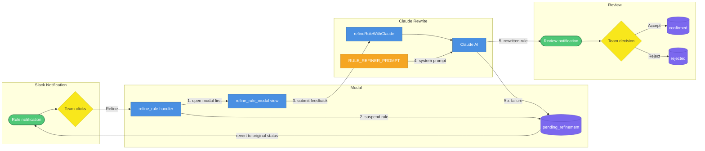
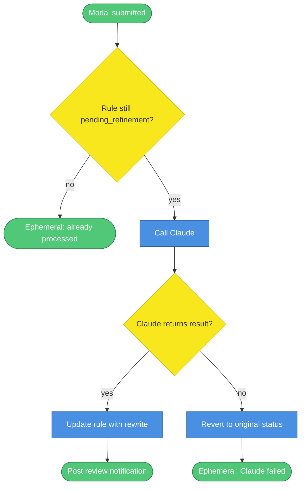

# Rule Refinement

> When Papi Chulo auto-learns a rule from a CS team edit, the team can now refine it — adding conditions and exceptions — rather than having to accept or reject it outright. This document covers the refinement flow: from clicking the Refine button in Slack through Claude rewriting the rule to the team approving or rejecting the result.

The first time the rule learning system fired, Gerardo noticed the rule it proposed was too general to trust blindly. He needed a way to say "yes, that's the right idea, *but only when X*." The refinement flow gives the team exactly that — they provide free-form feedback, Claude rewrites the rule to incorporate it, and the team sees the revised version before it goes live.

<!-- Mermaid Color Palette (used in all diagrams below)
classDef service fill:#4A90E2,stroke:#2E5C8A,color:#fff
classDef storage fill:#7B68EE,stroke:#5B4BC7,color:#fff
classDef external fill:#F5A623,stroke:#C4841A,color:#fff
classDef decision fill:#F8E71C,stroke:#C7B916,color:#333
classDef event fill:#50C878,stroke:#2D7A4A,color:#fff
classDef error fill:#E74C3C,stroke:#A93226,color:#fff

Legend: blue=service, purple=storage, orange=external, yellow=decision, green=event, red=error
-->

---

## 1. Refinement Flow

When a new rule notification appears in Slack, the CS team now sees three buttons: Accept, Refine, and Reject. Clicking Refine opens a modal, suspends the rule while the team provides feedback, sends that feedback to Claude for a rewrite, and then posts the revised rule back to the channel for a final review step.



| # | What happens |
|---|---|
| 1 | The `refine_rule` action handler opens the modal **before** doing any database work — Slack's `trigger_id` expires in 3 seconds, so the `views.open` call must come first |
| 2 | After the modal opens, the handler sets the rule's status to `pending_refinement` and invalidates the in-memory cache. The rule is now suspended: `getConfirmedRules()` won't return it, so it won't be injected into any prompts while refinement is in progress |
| 3 | The modal has two fields: a pre-filled rule text field (editable) and an empty conditions/exceptions field. The CS team can change the rule text, add conditions, or both. `private_metadata` carries the `ruleId`, original correction, original pattern, and original status |
| 4 | On modal submission, the view handler calls `refineRuleWithClaude()` in `skills/pipeline/rule-refiner.ts`. That function builds a user message with all five inputs (original pattern, original correction, refined text, conditions, scope) and calls `callClaude(RULE_REFINER_PROMPT, userMessage)` |
| 5 | Claude returns JSON in the same shape as the diff analyzer: `{pattern, correction, scope, skip, skipReason}`. The rule is updated with the rewritten text and a review notification is posted to the Slack channel showing the original correction, the team's feedback, and the rewritten version |
| 5b | If Claude returns null, fails to parse, or returns `skip: true`, the rule is immediately reverted to its pre-refinement status and an ephemeral error message is sent to the team member who submitted the modal |

---

## 2. Race Condition and Failure Handling

Two edge cases are explicitly guarded against: a team member double-clicking Refine, and a Claude failure leaving a rule permanently suspended.



| Scenario | What happens |
|---|---|
| **Double-click** | The modal submission handler checks that the rule is still `pending_refinement` before proceeding. If another submission already moved it forward, the second submission posts an ephemeral "already processed" message and exits without writing anything |
| **Claude failure** | If `refineRuleWithClaude()` returns null (network error, bad JSON, `skip: true`), the rule is immediately reverted to its status before refinement started — either `confirmed` or `proposed` — and an ephemeral error is posted to the submitting user. The rule is never left stuck in `pending_refinement` |
| **One attempt only** | Refinement is a single-shot operation. There is no retry or re-refine path. If the rewritten rule is rejected by the team, the rule is set to `rejected` — it does not revert to the original text |

---

## 3. Claude Rewrite Prompt

The rewrite uses a dedicated prompt (`skills/pipeline/rule-refiner-prompt.ts`) that is separate from the diff analyzer prompt. Both produce the same JSON shape so the parsing code is identical.

The user message sent to Claude contains five fields:

```
ORIGINAL_PATTERN: AI offers living room area when guest moves rooms
ORIGINAL_CORRECTION: Guest moves to new room; offer living room area to wait during turnover
REFINED_TEXT: Guest moves to new room; offer living room area to wait during turnover
CONDITIONS: Only when no other check-ins/check-outs in adjacent rooms and living room is available
SCOPE: 3505-BAN-2
```

Claude is instructed to incorporate `REFINED_TEXT` and `CONDITIONS` into a concise correction (≤15 words) and return:

```json
{
  "pattern": "AI offers living room area when guest moves rooms",
  "correction": "Offer living room area only if no adjacent check-ins/check-outs and living room available",
  "scope": "3505-BAN-2",
  "skip": false,
  "skipReason": null
}
```

The scope is preserved from the original unless the conditions suggest narrowing it to a specific property. `callClaude()` — a generic utility extracted from `skills/pipeline/real-time-analyzer.ts` — handles both proxy mode (`CLAUDE_MODE=proxy`) and direct API mode (`CLAUDE_MODE=api`).

---

## 4. Where to Find Things

| Concern | File |
|---|---|
| `LearnedRule` type (includes `pending_refinement` + `conditions`) | `skills/pipeline/learned-rules.ts` |
| Generic Claude call utility | `skills/pipeline/real-time-analyzer.ts` → `callClaude()` |
| Rewrite system prompt | `skills/pipeline/rule-refiner-prompt.ts` |
| Rewrite function | `skills/pipeline/rule-refiner.ts` → `refineRuleWithClaude()` |
| 3-button notification blocks | `skills/slack-blocks/notification-blocks.ts` |
| Refine button in weekly recap | `skills/slack-blocks/recap-blocks.ts` → `buildWeeklyRecapBlocks()` |
| Refinement modal | `skills/slack-blocks/recap-blocks.ts` → `buildRefineRuleModal()` |
| Review notification blocks | `skills/slack-blocks/recap-blocks.ts` → `buildRefinedRuleReviewBlocks()` |
| All new Slack action/view handlers | `skills/slack-bot/rule-handlers.ts` → `registerRuleHandlers()` |
