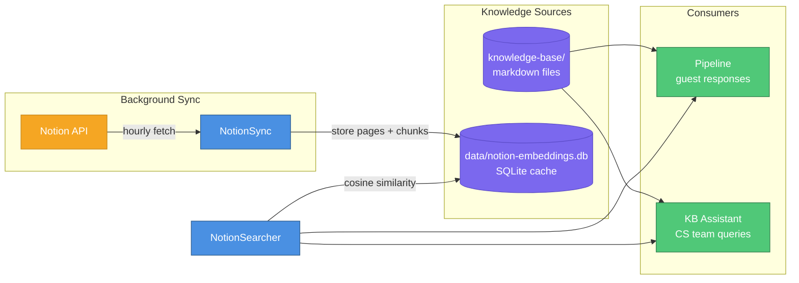
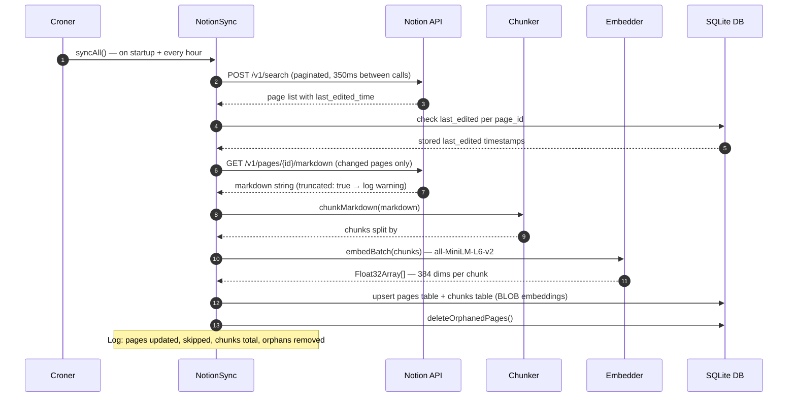
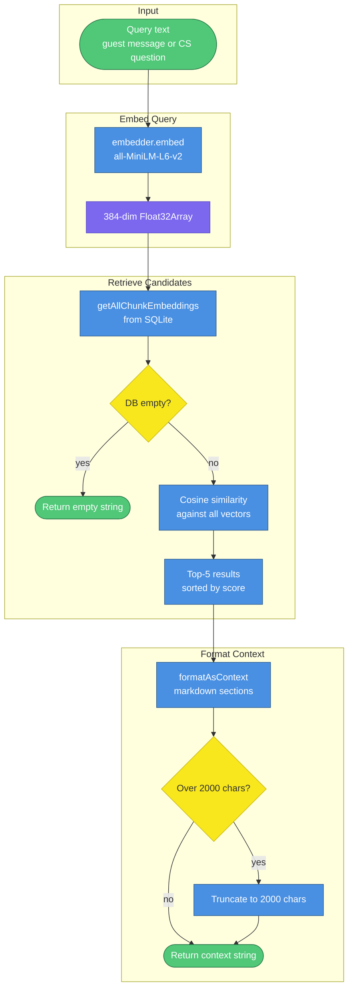
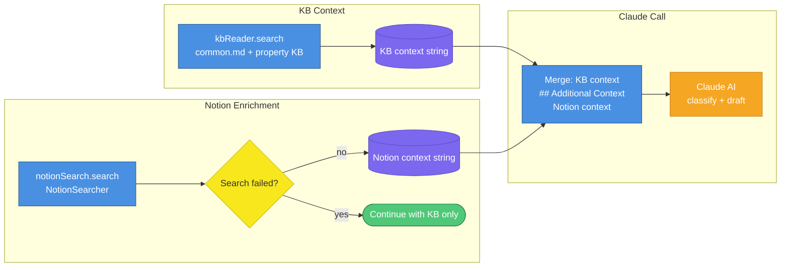
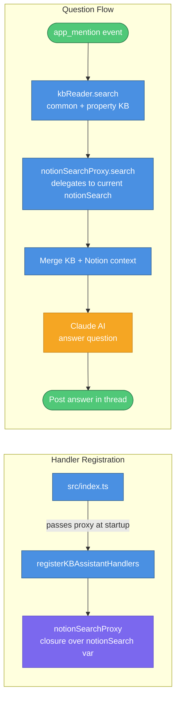
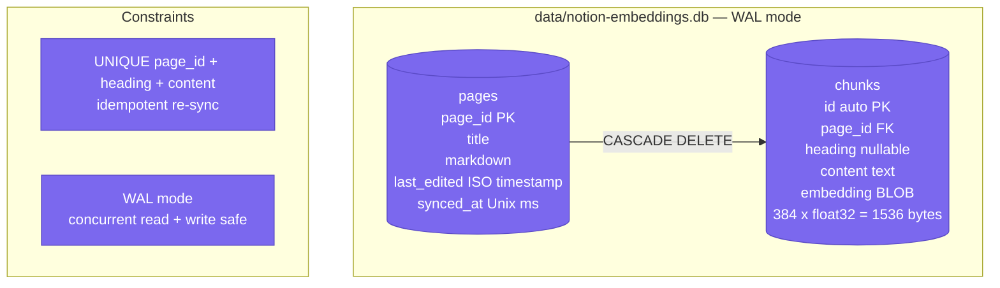

# Notion Wiki Integration

> This document covers the Notion wiki integration in Papi Chulo — a local embedding cache that makes the company's Notion workspace searchable by both the guest response pipeline and the KB Assistant. For the core guest messaging pipeline, see `2026-03-18-1312-architecture.md`. For the KB Assistant, see `2026-03-19-1202-kb-assistant.md`.

How Notion pages are synced, embedded, and searched. Each section has numbered steps with explanations below it.

<!-- Mermaid Color Palette (matches architecture.md)
classDef service fill:#4A90E2,stroke:#2E5C8A,color:#fff
classDef storage fill:#7B68EE,stroke:#5B4BC7,color:#fff
classDef external fill:#F5A623,stroke:#C4841A,color:#fff
classDef decision fill:#F8E71C,stroke:#C7B916,color:#333
classDef event fill:#50C878,stroke:#2D7A4A,color:#fff
classDef error fill:#E74C3C,stroke:#A93226,color:#fff
classDef future fill:#B0B0B0,stroke:#808080,color:#333,stroke-dasharray: 5 5

Legend: blue=service, purple=storage, orange=external, yellow=decision, green=event, red=error, gray-dashed=future
-->

---

## 1. System Context

Where Notion fits in the overall Papi Chulo architecture — a second knowledge source that runs alongside the existing markdown KB files and feeds context into both the guest response pipeline and the KB Assistant.

| # | What happens |
|---|---|
| 1 | `NotionSync` runs as a background job, fetching pages from the Notion API and storing them locally |
| 2 | Pages are chunked by heading and embedded into 384-dimensional vectors, then stored in SQLite alongside the raw markdown |
| 3 | `NotionSearcher` answers queries by embedding the query text and computing cosine similarity against all stored chunk vectors |
| 4 | The guest response pipeline calls `NotionSearcher` after the markdown KB search — Notion context is appended under a separator before the Claude call |
| 5 | The KB Assistant calls `NotionSearcher` the same way, enriching answers to CS team @mention questions |
| 6 | If `NOTION_TOKEN` is not set, the integration is disabled entirely — both consumers receive an empty string and continue normally |

---

## 2. Sync Flow

How pages are fetched from Notion and stored locally — a background job that runs hourly and on startup.

| # | What happens |
|---|---|
| 1 | `croner` fires `syncAll()` immediately on startup, then on the configured interval (default: every hour) |
| 2 | `notion.search()` is called with pagination — the Notion API `POST /v1/search` endpoint returns page titles and metadata. Rate limit is 3 req/sec; a 350ms delay is inserted between page fetches |
| 3 | Each page's `last_edited_time` is compared against the value stored in SQLite. Pages with no change are skipped entirely |
| 4 | For changed pages, `GET /v1/pages/{id}/markdown` (Notion API 2026-03-11) fetches the full page as a markdown string. If the response includes `truncated: true`, a `[NOTION]` warning is logged |
| 5 | `chunkMarkdown()` splits the markdown on `##` and `###` headers. Chunks shorter than `NOTION_MIN_CHUNK_LENGTH` (default: 50 chars) are filtered out |
| 6 | `embedder.embedBatch()` runs all chunks through `Xenova/all-MiniLM-L6-v2` (cached in `~/.cache/huggingface/hub/`). Each chunk produces a 384-dimensional `Float32Array` |
| 7 | Chunks and their embeddings are upserted into SQLite. The unique constraint on `(page_id, heading, content)` makes re-syncs idempotent |
| 8 | `deleteOrphanedPages()` removes any `pages` rows whose `page_id` no longer appears in the Notion workspace. Cascading deletes clean up the associated `chunks` rows automatically |

---

## 3. Search Flow

How a query gets answered from the Notion wiki — runs on every incoming guest message and every KB Assistant @mention.

| # | What happens |
|---|---|
| 1 | `NotionSearcher.search(query)` is called with the raw query text |
| 2 | The query is embedded using the same `Xenova/all-MiniLM-L6-v2` model used during sync — this ensures the query vector lives in the same space as the stored chunk vectors |
| 3 | `getAllChunkEmbeddings()` loads all chunk rows from SQLite. If the table is empty (no sync has run yet, or Notion is not configured), an empty string is returned immediately |
| 4 | Cosine similarity is computed between the query vector and every stored chunk vector. This is brute-force — fast and correct for fewer than 2,000 vectors |
| 5 | The top `NOTION_TOP_K` results (default: 5) are returned, sorted by descending similarity score |
| 6 | `formatAsContext()` formats each result as a markdown section with the page title and chunk heading as a header, followed by the chunk content |
| 7 | The combined context string is capped at `NOTION_MAX_CONTEXT_CHARS` (default: 2,000 chars). If it exceeds the cap, it's truncated with a trailing `…` |

---

## 4. Guest Response Pipeline Integration

How Notion wiki context is injected into guest response drafts — appended after the markdown KB context, before the Claude call. For the full pipeline flow, see `2026-03-18-1312-architecture.md` Section 4.

| # | What happens |
|---|---|
| 1 | `kbReader.search()` runs first, returning relevant sections from `common.md` and the property-specific KB file |
| 2 | `PipelineContext` exposes a `get notionSearch()` getter that reads the live `notionSearch` value at call time. This is safe even if the embedding model is still loading when the pipeline starts — the getter always reflects the current state |
| 3 | `notionSearch.search(guestMessage)` is called with the raw guest message text |
| 4 | If the Notion search throws (DB not initialized, model not loaded), the error is caught and logged. The pipeline continues with KB-only context — Notion is never a hard dependency |
| 5 | If Notion returns a non-empty context string, it is appended to the KB context under a `## Additional Context (Company Wiki)` separator |
| 6 | The merged context string is passed to Claude alongside the guest message, conversation history, and guest details |

---

## 5. KB Assistant Integration

How Notion wiki context enriches answers to CS team @mention questions. For the full KB Assistant flow, see `2026-03-19-1202-kb-assistant.md`.

| # | What happens |
|---|---|
| 1 | At startup, `src/index.ts` creates a `notionSearchProxy` object — a plain object whose `.search()` method delegates to the current value of the `notionSearch` variable via closure |
| 2 | The proxy is passed to `registerKBAssistantHandlers()` at registration time. Because it's a proxy (not the `NotionSearcher` instance directly), the handler always calls whatever `notionSearch` points to when the question arrives |
| 3 | This matters because the `Xenova/all-MiniLM-L6-v2` model loads asynchronously. If a question arrives before the model finishes loading, the proxy safely delegates to the not-yet-ready instance, which returns an empty string rather than throwing |
| 4 | On an @mention, `kbReader.search()` runs first (same as the guest pipeline), then `notionSearchProxy.search()` is called with the stripped question text |
| 5 | If Notion returns context, it is appended under `## Additional Context (Company Wiki)` before the Claude call — identical to the guest pipeline pattern |
| 6 | Claude receives the combined context and answers the question. The KB Assistant's answer format (`{ found, answer, source }`) is unchanged — Notion context is invisible to the response format |

---

## 6. Data Model

What is stored in SQLite and how the two tables relate — a local embedding cache that makes Notion searchable without hitting the API on every query.

| Detail | Explanation |
|---|---|
| **`pages` table** | One row per Notion page. `page_id` is the Notion page UUID. `markdown` stores the full page content as returned by the API. `last_edited` is the ISO timestamp from Notion — used to skip unchanged pages on re-sync. `synced_at` is the Unix millisecond timestamp of the last successful sync |
| **`chunks` table** | One row per indexed section. `page_id` is a foreign key to `pages` with `ON DELETE CASCADE` — deleting a page removes all its chunks automatically. `heading` is the `##` or `###` header text (nullable for content before the first heading). `embedding` is stored as a raw BLOB: 384 `float32` values = 1,536 bytes per chunk |
| **Unique constraint** | `UNIQUE(page_id, heading, content)` ensures that re-syncing the same page is idempotent — duplicate chunks are ignored via `INSERT OR IGNORE` |
| **WAL mode** | Write-Ahead Logging is enabled on startup. This allows the hourly sync (writer) and per-message search (reader) to run concurrently without blocking each other |
| **Default path** | `data/notion-embeddings.db`. Override with `NOTION_DB_PATH`. The `data/` directory is gitignored — the file is created automatically on first sync |

---

## Environment Variables

All Notion integration settings are optional. The integration is disabled entirely if `NOTION_TOKEN` is not set — no errors, no warnings, just empty context strings passed to Claude.

| Variable | Default | Description |
|---|---|---|
| `NOTION_TOKEN` | — | **Required to enable.** Internal integration secret from notion.so/profile/integrations |
| `NOTION_DB_PATH` | `data/notion-embeddings.db` | Path for the local SQLite embedding cache |
| `NOTION_SYNC_INTERVAL_HOURS` | `1` | How often to re-sync from Notion |
| `NOTION_MAX_CONTEXT_CHARS` | `2000` | Hard cap on Notion context injected into Claude |
| `NOTION_TOP_K` | `5` | Number of most-relevant wiki chunks to retrieve per query |
| `NOTION_MIN_CHUNK_LENGTH` | `50` | Minimum chars for a section to be indexed |
