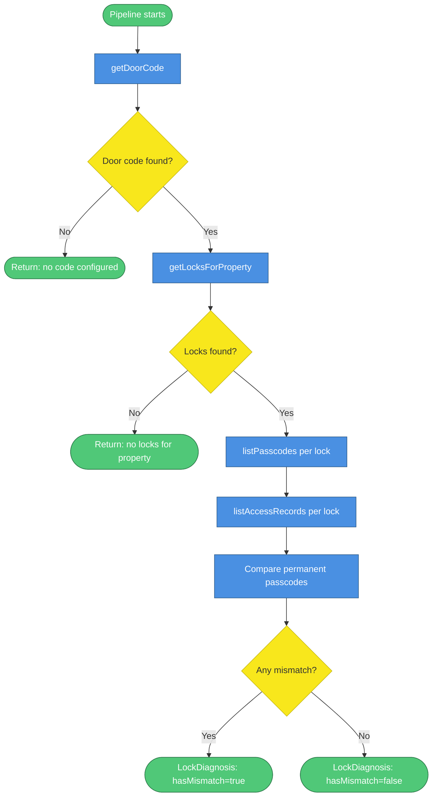
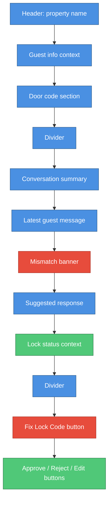

# Sifely Lock Integration

Papi Chulo integrates with Sifely smart locks to give the CS team real-time visibility into door code status for every guest message. When a message arrives, the pipeline fetches the property's Hostfully door code, queries the associated Sifely locks via vlre-hub, and compares the permanent passcodes on each lock against what Hostfully has on record. If they don't match, a mismatch banner appears in Slack alongside a "Fix Lock Code" button that lets the CS team push the correct code to all affected locks in one click.

---

## What It Does

- **Door code in every Slack message** — The Hostfully door code is always shown in the approval message, regardless of whether any locks are configured. If no code is set in Hostfully, the field shows "Not configured."

- **Mismatch detection** — When a property has Sifely locks registered in vlre-hub, the pipeline fetches each lock's permanent passcodes (type 2) and checks whether any of them match the Hostfully door code. If a lock has permanent passcodes and none match, a mismatch banner appears in the Slack message. Locks with only timed or one-time codes are excluded from this check.

- **Fix Lock Code** — When a mismatch is detected, a red "Fix Lock Code" button appears in the Slack message. Clicking it pushes the Hostfully door code into Sifely for every mismatched lock. Hostfully is the source of truth; the fix always flows from Hostfully into Sifely, never the other way.

---

## Data Sources

| Source | What it provides | When it's called |
|---|---|---|
| Hostfully custom data | `door_code` field from property custom data | Every pipeline run, before lock diagnosis |
| vlre-hub `GET /internal/properties/:uid/locks` | List of Sifely lock IDs and names for the property | After door code is fetched, if door code is non-null |
| Sifely `GET /v3/lock/listKeyboardPwd` | All passcodes on a lock (permanent, timed, one-time) | Once per lock, in parallel |
| Sifely `GET /v3/lockRecord/list` | Access attempts in the last 2 hours | Once per lock, in parallel with passcode fetch |

---

## Lock Diagnosis Flow



| Step | What happens | Output |
|---|---|---|
| `getDoorCode` | Calls Hostfully custom data API for the property | `string \| null` |
| `getLocksForProperty` | Calls vlre-hub with the Hostfully property UID | `PropertyLock[]` (sifelyLockId, lockName, lockRole) |
| `listPasscodes` | Calls Sifely `/v3/lock/listKeyboardPwd` for each lock | `LockPasscode[]` with type field (1=one-time, 2=permanent, 3=timed) |
| `listAccessRecords` | Calls Sifely `/v3/lockRecord/list` for the last 2 hours | `AccessRecord[]` with success/failure and code used |
| Compare | Filters to permanent passcodes (type 2), checks if any match the Hostfully door code | `matchesHostfully: boolean` per lock |
| `LockDiagnosis` | Aggregates all lock results into a summary | `hasMismatch`, `diagnosisSummary`, per-lock detail |

---

## Mismatch Detection Logic

A mismatch is only flagged when a lock has at least one permanent passcode (type 2) and none of them match the Hostfully door code. Locks that only have timed or one-time codes are skipped entirely — they're not expected to hold the guest door code.

```typescript
// Only flag mismatch when the lock has PERMANENT passcodes (type 2)
// but none match the door code.
const hasMismatch = lockResults.some(
  (r) => !r.matchesHostfully && r.passcodes.filter((p) => p.keyboardPwdType === 2).length > 0
);
```

The comparison is a strict string equality check between `keyboardPwd` (from Sifely) and `hostfullyDoorCode` (from Hostfully custom data). Both are treated as strings — no numeric coercion.

If Sifely is unreachable for a specific lock, that lock's passcode and access record arrays are left empty and the lock is skipped in the mismatch check. Other locks continue normally. This means a partial Sifely outage won't block the pipeline or produce false positives.

---

## What the CS Team Sees

### On every message

Every Slack approval message includes a door code section:

```
🔑 Door Code: `1234`
```

If Hostfully has no door code configured for the property, it shows:

```
🔑 Door Code: Not configured
```

This section is always present, regardless of whether any Sifely locks are associated with the property.

### On access messages with a mismatch

When the diagnosis detects a mismatch, two additional elements appear in the message:

1. A **mismatch banner** with the Hostfully door code and a per-lock breakdown showing which locks match and which don't.
2. A **lock status context block** with the full `diagnosisSummary` text (access attempts, failed codes, etc.).
3. A red **"Fix Lock Code" button** above the standard Approve/Reject/Edit buttons.

The Slack message layout looks like this:



The mismatch banner and Fix Lock Code button only appear when `hasMismatch` is true. The lock status context block appears whenever `lockDiagnosis` is non-null (even when all codes match).

---

## Fix Lock Code Action

When a CS team member clicks "Fix Lock Code":

1. **CS clicks the button.** The Slack action fires with the button value, which contains the Hostfully door code and a list of mismatched locks (up to 5, each with `sifelyLockId` and `lockName`).

2. **`ack()` fires immediately.** Slack requires acknowledgment within 3 seconds. The handler calls `ack()` before doing any async work.

3. **Slack updates to "Fixing..."** The message is immediately replaced with a "⏳ Fixing lock codes... Please wait." section so the CS team knows the action is in progress.

4. **For each mismatched lock:** The handler calls `listPasscodes` to get the current passcode list, filters to permanent passcodes (type 2), and calls `updatePasscode` with the Hostfully door code as the new value. Only the first permanent passcode on each lock is updated.

5. **Slack updates with the result.** If all locks succeed: `✅ Lock codes fixed! All N lock(s) now accept code 1234`. If some fail: `⚠️ Partial fix: N/M locks updated. Failed: [lock name]: [error]`.

6. **An audit log entry is written** to `logs/actions.jsonl` with action type (`lock_code_fix_completed` or `lock_code_fix_partial`), the user who triggered it, the door code, and per-lock results.

> **Important:** Hostfully is the source of truth. The fix pushes Hostfully's `door_code` into Sifely. It never reads from Sifely to update Hostfully.

---

## Configuration

| Variable | Required | Description | Default |
|---|---|---|---|
| `SIFELY_BASE_URL` | No | Sifely API base URL | `https://app-smart-server.sifely.com` |
| `SIFELY_CLIENT_ID` | Yes | App client ID from the Sifely developer portal | — |
| `SIFELY_USERNAME` | Yes | Sifely account email address | — |
| `SIFELY_PASSWORD` | Yes | MD5 hash of the Sifely account password | — |
| `VLRE_HUB_URL` | Yes | Internal URL for the vlre-hub service | `http://localhost:7311` |

The `SIFELY_PASSWORD` value must be the MD5 hash of the plaintext password, not the plaintext itself. Sifely's login endpoint expects the hash.

The `SifelyClient` caches its auth token in memory and refreshes it 2 hours after the last login. If a request fails with an auth-related error, it clears the cached token and retries once with a fresh login. Note that Sifely returns HTTP 200 even on auth failure — the client checks `response.code`, not the HTTP status.

---

## vlre-hub Dependency

vlre-hub is a separate internal service that maps Hostfully property UIDs to their associated Sifely locks. Papi Chulo calls:

```
GET /internal/properties/:hostfullyPropertyUid/locks
```

The response looks like:

```json
{
  "locks": [
    {
      "lockId": "internal-id",
      "sifelyLockId": "12345678",
      "lockName": "Front Door",
      "lockRole": "FRONT_DOOR"
    }
  ]
}
```

This endpoint requires no authentication. It's only reachable over the Tailscale internal network, so network-level access control replaces application-level auth.

The endpoint exists because Sifely has no concept of "property" — it only knows about individual locks. vlre-hub holds the mapping between Hostfully property UIDs and Sifely lock IDs, which lets Papi Chulo look up the right locks for any incoming guest message.

---

## Graceful Degradation

The pipeline never crashes due to Sifely or vlre-hub failures. Each failure mode has a defined fallback:

- **Hostfully custom data unavailable** — `doorCode` is `null`. The door code section shows "Not configured." No lock diagnosis is attempted.
- **vlre-hub unavailable** — `getLocksForProperty` catches the error, logs a warning, and returns `[]`. No lock section appears in the Slack message.
- **Sifely unavailable for one lock** — That lock's passcode and access record arrays are left empty. The lock is skipped in mismatch detection. Other locks continue normally.
- **Sifely completely unavailable** — All locks are skipped. `lockDiagnosis` is returned with `hasMismatch: false` and an empty lock list. No mismatch banner or Fix Lock Code button appears.

In all failure cases, the rest of the pipeline (classification, drafting, Slack posting) continues unaffected.
